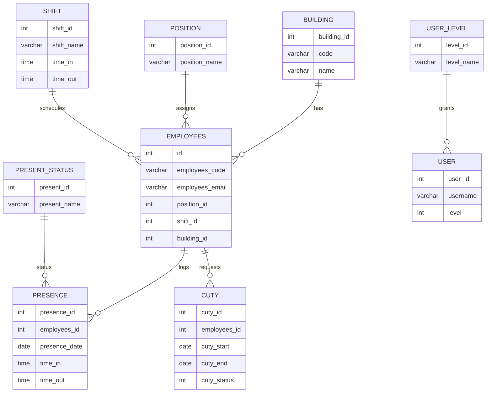

# Sistem Absensi RSU Ambon

Aplikasi absensi karyawan berbasis web untuk RSU Ambon. Fokus pada pencatatan kehadiran yang rapi, audit trail yang jelas, dan pengelolaan data pegawai yang terstruktur.

## Metadata

| Item | Nilai |
| --- | --- |
| Versi | 1.0.0 |
| Lingkup | Internal RSU Ambon |
| Update Terakhir | 6 Mei 2026 |

---

## Ringkasannya

| Area    | Highlight                                |
| ------- | ---------------------------------------- |
| Absensi | Masuk/keluar berbasis foto dan koordinat |
| SDM     | Karyawan, jabatan, shift, lokasi/gedung  |
| Cuti    | Pengajuan, persetujuan, rekap            |
| Laporan | Rekap per periode, siap cetak            |

---

## Fitur Utama

- Absensi masuk/keluar dengan foto dan koordinat lokasi.
- Master data: karyawan, jabatan, shift, lokasi/gedung.
- Cuti: pengajuan dan persetujuan oleh admin.
- Panel admin dan operator dengan kontrol akses.
- Laporan kehadiran per periode.

## Tech Stack

- Backend: PHP 7.x (native).
- Database: MySQL/MariaDB.
- Frontend: HTML, CSS, JavaScript, jQuery.
- Library: Chart.js, Mobile Detect, mPDF, PHP QRCode, Google Client.

Referensi dependensi lokal ada di [sw-library](sw-library) dan [dc-admin/plugins](dc-admin/plugins).

---

## Struktur Singkat

| Folder                                             | Peran                        |
| -------------------------------------------------- | ---------------------------- |
| [dc-admin](dc-admin)                               | Panel admin dan login        |
| [sw-mod](sw-mod)                                   | Modul aplikasi               |
| [sw-assets](sw-assets)                             | Aset statis                  |
| [sw-library](sw-library)                           | Library inti dan konfigurasi |
| [Database/db_absensi.sql](Database/db_absensi.sql) | Skema dan data awal          |

---

## Alur Database (Ringkas)

1. Admin membuat data master: jabatan, shift, lokasi/gedung.
2. Admin menambahkan karyawan dan mengaitkan ke jabatan, shift, serta gedung.
3. Karyawan melakukan absensi masuk/keluar (foto + koordinat disimpan).
4. Data kehadiran direkap untuk laporan periodik.
5. Pengajuan cuti dicatat dan disetujui oleh admin.
6. Profil instansi disimpan di tabel `sw_site`.

## Relasi Tabel (ERD)

Catatan: relasi di atas mengikuti struktur di [Database/db_absensi.sql](Database/db_absensi.sql). Sebagian relasi tidak didefinisikan sebagai foreign key, namun direferensikan secara logis oleh aplikasi.

---

## Konfigurasi & Instalasi

1. Buat database baru, mis. `db_absensi`.
2. Import file SQL: [Database/db_absensi.sql](Database/db_absensi.sql).
3. Sesuaikan konfigurasi database di [sw-library/sw-config.php](sw-library/sw-config.php).
4. Letakkan proyek pada web server (Apache/Nginx) dan pastikan PHP aktif.

## Titik Masuk Aplikasi

- Halaman utama: [index.php](index.php)
- Login admin: [dc-admin/login](dc-admin/login)
- Panel admin: [dc-admin/index.php](dc-admin/index.php)

---

## Modul Utama

- Dashboard: ringkasan absensi dan statistik.
- Karyawan: data pegawai dan profil.
- Absensi: log kehadiran masuk/keluar.
- Cuti: pengajuan dan persetujuan.
- Master: jabatan, shift, gedung/lokasi.

## Catatan Keamanan

- Ganti kredensial database dan akun admin default setelah instalasi.
- Pastikan folder upload gambar memiliki izin akses yang tepat.
- Nonaktifkan akun demo pada lingkungan produksi.

---

## Lisensi

Proyek internal. Silakan sesuaikan sesuai kebutuhan organisasi.
